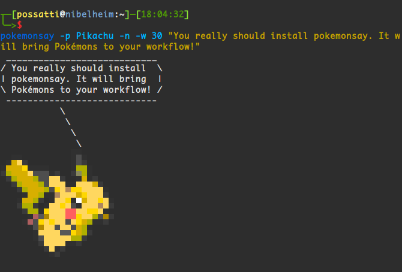

pokemonsay (Package-friendly)
==========
Based on rominzxx/pokemonsay : https://github.com/rominzxx/pokemonsay
Version : 20171228 (Lastest commit : aef1b07fe5b122af812dedff4dfa81c47b3ceaf6 )

`pokemonsay` is like [`cowsay`][cowsay] but for pokémon only. It was inspired by [`ponysay`][ponysay] (`cowsay` for ponies). Internally, `pokemonsay` still uses `cowsay`, so you need it installed too (`cowsay`... not `ponysay`).

This Github repository is based on rominzxx/pokemonsay (https://github.com/rominzxx/pokemonsay), which have a .cow file for every existing Pokémons. The main goal is to make pokemonsay easier to package for Arch-based distros. It may works for other package formats.

## Installation

## NOTICE

Please notice I don't own Pokémon or anything related to it. Pokémon is property of [The Pokémon Company][the-pokemon-company].

[img2xterm]: https://github.com/rossy/img2xterm
[cowsay]: https://en.wikipedia.org/wiki/Cowsay
[ponysay]: https://github.com/erkin/ponysay
[the-pokemon-company]: https://en.wikipedia.org/wiki/The_Pok%C3%A9mon_Company
